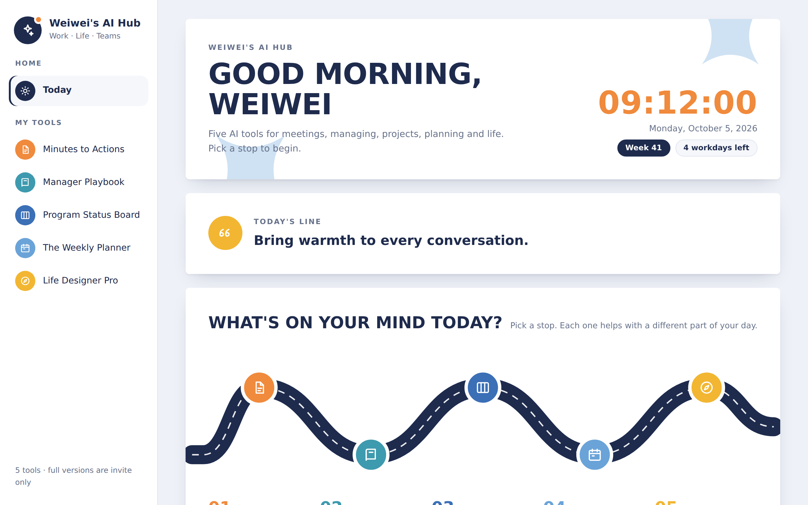
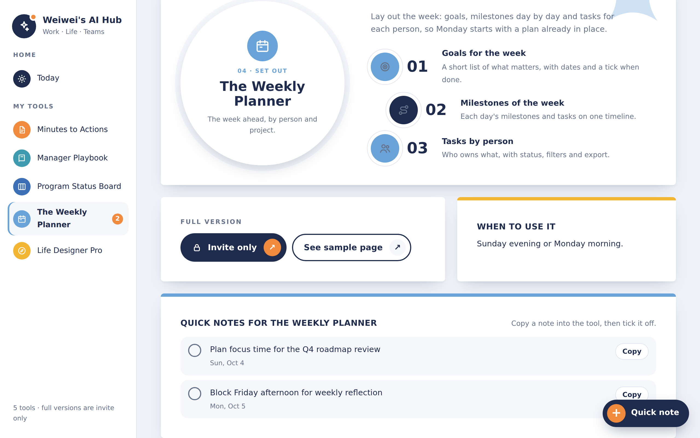
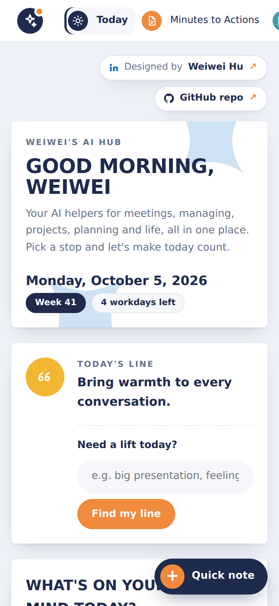
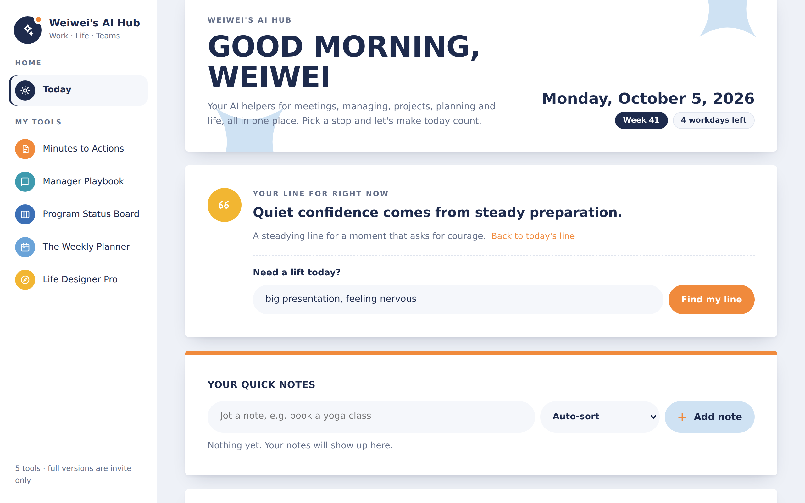
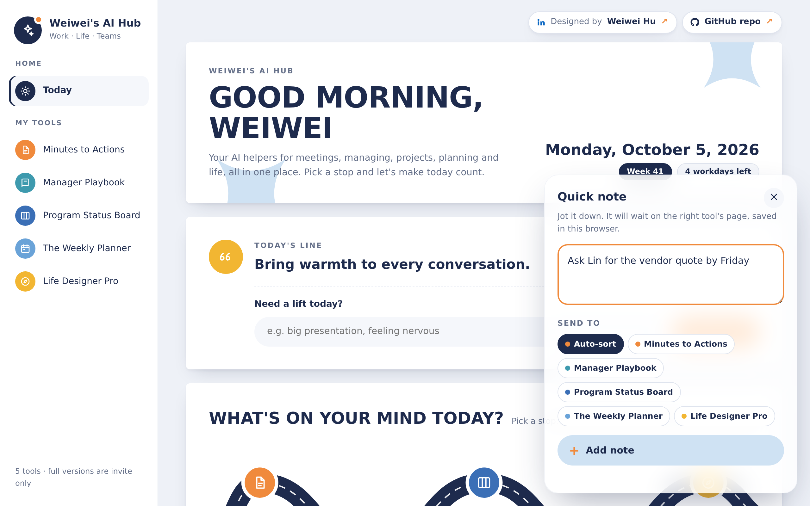
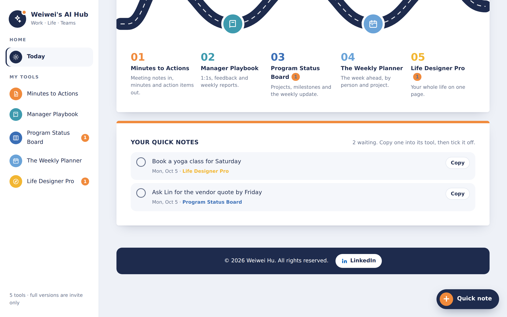

# Weiwei's AI Hub

**🌐 Live page: [wei-wei-hu.github.io/ai-hub](https://wei-wei-hu.github.io/ai-hub/)**

Your AI helpers for meetings, managing, projects, planning and life, all in one place, by Weiwei Hu. Pick a stop on the road and see how each tool can help your day.

### [Open the AI Hub →](https://wei-wei-hu.github.io/ai-hub/)

It opens in your browser on a phone or laptop. Nothing to install, and no sign-in.

## What's inside

The **Today** page greets you with the time, the date, the week number and how many workdays are left. Below that is a road with one stop for each tool.

| # | Tool | What it helps with |
|---|------|--------------------|
| 01 | **Minutes to Actions** | Meeting notes in, minutes and action items out. |
| 02 | **Manager Playbook** | 1:1s, feedback and weekly reports. [See sample page](https://wei-wei-hu.github.io/manager-playbook/) |
| 03 | **Program Status Board** | Projects, milestones and the weekly update. |
| 04 | **The Weekly Planner** | The week ahead, by person and project. [See sample page](https://wei-wei-hu.github.io/the-weekly-planner/) |
| 05 | **Life Designer Pro** | Your whole life on one page. [See sample page](https://wei-wei-hu.github.io/life-designer-pro/) |

Each tool has its own page. It explains what the tool does in three steps and suggests when to use it.

  
  

## Today's line and "Need a lift today?"

Every day the Hub shows a short line to start the day well. There are 366 of them, one for each day of the year, so none repeats within a year.

Want a line that fits your day? Type what's on your mind, such as "big presentation, feeling nervous," and tap **Find my line**. The Hub picks the line that matches best and tells you why it fits.

## Quick note

Tap **+ Quick note** at the bottom right of any page to jot down a thought before it slips away. Choose **Auto-sort** and the Hub sends it to the tool where it fits, or pick a tool yourself.

- All your notes show under **Your quick notes** on the Today page.
- Each tool's page lists the notes waiting for it, and the sidebar shows a count.
- Tap **Copy** to paste a note into the tool, then tick the circle when it's done.
- Notes are saved in your own browser. Nobody else can see them, and nothing is sent anywhere.

  
  

## Full versions

The full versions of the tools are **invite only**. To learn more, visit [Weiwei Hu on LinkedIn](https://www.linkedin.com/in/weiweihu/).

- Live page: https://wei-wei-hu.github.io/ai-hub/
- LinkedIn: https://www.linkedin.com/in/weiweihu/

## License

This repository is **proprietary**. It is not open source. You may view the code and use the live page for personal, non-commercial use. Copying, changing, reusing, hosting, selling, or using any part of it to train AI requires written permission from Weiwei Hu. See [LICENSE](LICENSE) for the full terms.

© 2026 Weiwei Hu. All rights reserved.
